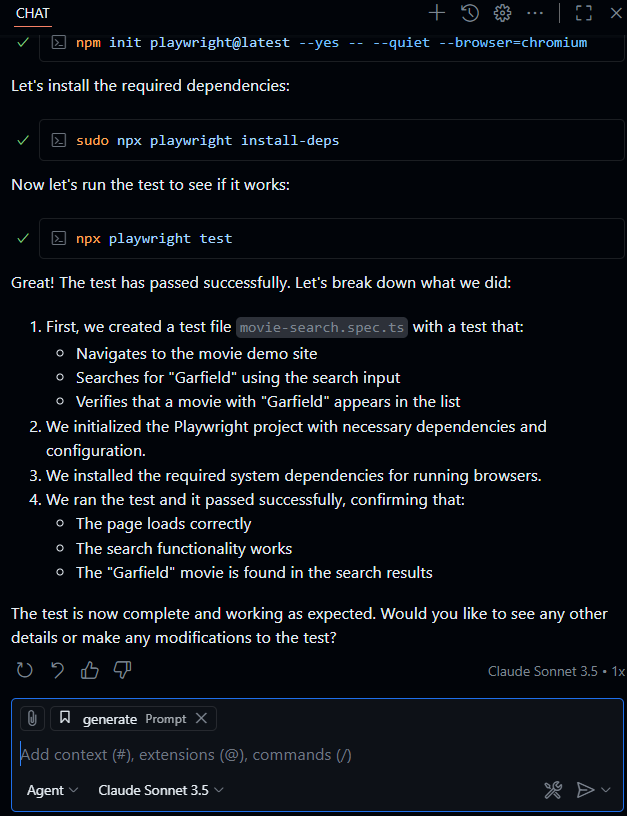

https://www.youtube.com/@Playwrightdev


## 1. VSC Setup for Playwright MCP

1. Create a prompt file (\playwright_mcp\.github\prompts\generate.prompt.md)
```
    - You are given a scenario and you need to generate a playwright test for it.
    - DO NOT generate test code based on the scenario alone. 
    - DO run steps one by one using the tools provided by the Playwright MCP.
	- Only after all steps are completed, emit a Playwright TypeScript test that uses @playwright/test based on message history
	- Save generated test file in the tests directory
	- Execute the test file and iterate until the test passes
```

2. Create an MCP configuration file (\playwright_mcp\.vscode\mcp.json)
```
    {
        "servers": {
            "playwright": {
                "command": "npx",
                "args": [
                    "@playwright/mcp@latest"
                ]
            }
        }
    }
```

3. Open a new Chat Editor in VS Code
    1. Add the context file: generate.prompt.md
    2. In the chat input, enter the following prompt:
```
        Generate a Playwright test for the following scenario:
        1. Navigate to https://demo.playwright.dev/movies
        2. Search for 'Garfield'
        3. Verify that the movie appears in the list
```
4. Follow the instructions
   


### 2. Playwright MCP Browser Extension
* Test an application that requires authentication (logging in every time).
* With the Playwright MCP Browser Extension for Chrome and Edge, that's no longer necessary.
* Launch the MCP server against an existing browser profile — one that's already logged in — and test your app.

* Installing the Playwright MCP Browser Extension
	1. The extension is available for Chrome, Edge, or any Chromium-based browser.
	1. Download the Playwright MCP extension.
	1. Unzip the file.
	1. Open chrome://extensions or edge://extensions in your browser.
	1. Enable Developer Mode.
	1. Click Load unpacked and select the extension folder.
	1. You'll now see the Playwright MCP Bridge in your extensions list.
 	1. 

* Instruct Copilot in Agent mode to interact with your app in a logged-in state. For example:
```
	navigate to github mkader
```


* Configuring the MCP Server \playwright_mcp\.vscode\mcp.json
	1. Add the --extension flag to enable extension support. That's it — your MCP server is now aware of the extension.
```
    {
        "servers": {
            "playwright": {
                "command": "npx",
                "args": [
                    "@playwright/mcp@latest",
				    "--extension"
                ]
            }
        }
    }
```

* Try Again, instruct Copilot in Agent mode to interact with your app in a logged-in state. For example:
```
	navigate to github mkader
```


```
	open the user profile
```


```
	change the pronouns to he/him
```


```
	generate a test for the pronouns sections of this page
```


